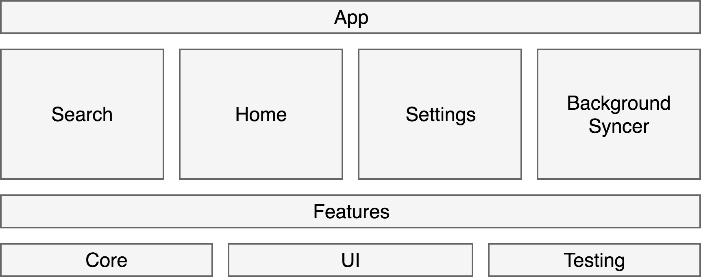
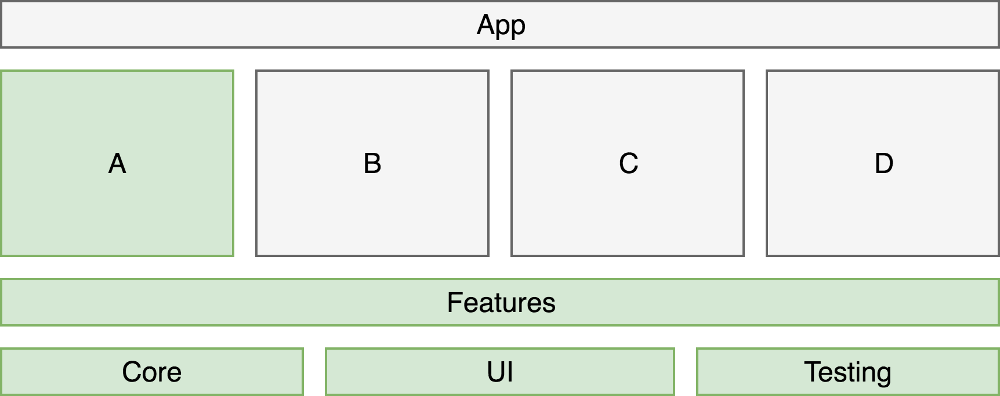

footer: @pepibumur
slidenumbers: true

# Developing modular apps on iOS
#### NSPresenter Madrid - February 28th
[.footer: ]

### **@pepibumur**


---

# About me

- Production Engineer at Shopify.
- Building tools for mobile developers.
- Born and raised in the ❤️ Murcia.
- Suffering the ☔️ in Berlin.
- 📄 _ppinera.es_
- 🐦 _@pepibumur_
- 📧 _pedro.pinera@shopify.com_


[.footer: ]

---

# What/why/how
### **should I modularize my app?**

---

# What


---

> "Modularizing an app consists on organising your app code and resources in multiple modules"

---

# A module can be

- *A library:* If it doesn't have resources.
- *A framework:* If it has them.
- *Static:* If it's linked at compile time.
- *Dynamic:* If it's linked at startup time.

---

### Static linking - **Compilation time**
### Dynamic linking - **Startup time**

---

# Dynamic modules **need to be copied** into the product for dylib to link them

---

# Static modules not properly linked might lead to **duplicated symbols**

---

# **Carthage** & **CocoaPods** are two examples of tools that modularise your dependencies

### Carthage: Dynamic linking
### CocoaPods: Static & dynamic linking

---

# Most of apps are usually built and grown as **monoliths**
### 1 target with the app source
### 1 target with the tests
### _(And maybe some extensions)_

---

# Why


---

# If you are a freelancer 👩‍💻👨‍💻
### **You might want to reuse code**

---

# If you have multiple products 💻⌚️📱
### **You might want to reuse code**
### *(e.g. Shopify has 5 iOS apps)*

---

# If you want to write weakly coupled components 🏝
### **You can leverage modules interfaces**
### *(internal by default in Swift)*

---

# If you want to speed up your workflow ⏰
### **And spend less time waiting for the compiler**

---

# The compile time is proportional to the **size of the codebase**

---

# But...

### Apple is improving the Swift compiler
### The compiler builds incrementally *(only clean builds should take more time)*

---

- ⌘ + B (10 minutes)
- Change code + (⌘ + B) (4 Seconds)
- Change something + (⌘ + B) - (Error)
- *⌘ + K (I'm sure this helps)*
- *⌘ + B (10 minutes)*

---

- 30 developers.
- 10 clean builds per day.
- 10 minutes per clean build.

*1000 hours spent per month*
*6.25 engineers*

---

# 😛 **Fortunately**, there's something you can do to avoid this

---

# How


---

# This is just **one approach**
### That works in my experience

---

# Layers
# Project
# Downsides

---

# Before anyone asks...

---

# Yes, to avoid the hassle of dealing with versioning or git submodules, **all the modules in the same repository**

---

# Microfeatures
### **[github.com/pepibumur/microfeatures-guidelines](https://github.com/pepibumur/microfeatures-guidelines)**

---



---

# App module

### Navigation
### App lifecycle events
### Dependency injector

---

```swift
// App
import Core

class Registry {
  static let client = Client(url: "https://shopify.com")
  static let analytics = Tracker(providers: [.firebase])
  static let logger = Logger()
}

```

---

```swift
import Product
import Home

// Module: App
class HomeCoordinator: HomeDelegate {

  let navigationController: UINavigationController!

  // HomeDelegate

  func didSelectProduct(id: String) {
    let vc = ProductFeature(id: id, client: Registry.client, analytics: Registry.analytics)
      .viewController
    navigationController.pushViewController(productViewController)
  }

}

```

---

# Features modules

### Can be **product** or **service** features

---

```swift
import Core

// Module: Product
public class ProductFeature {

  public init(id: String, client: Client, analytics: Analytics) {
    // Initialization
  }

  // !! We just expose UIKit classes
  public var viewController: UIViewController {
    // Initialization & dependency injection
  }
}

```

---

```swift
import Core

// Module: BackgroundSync
public class BackgroundSyncer {
  public init(client: Client, store: Store) { /* Init */ }
  public func sync(completion: @escaping (Error?) -> Void)
}

// Module: App
@UIApplicationMain
class AppDelegate: UIResponder, UIApplicationDelegate {
  func application(_ application: UIApplication,
                     performFetchWithCompletionHandler completionHandler: @escaping (UIBackgroundFetchResult) -> Void) {
       Registry.backgroundSyncer.sync { error in
         // Notify completionHandler
       }
    }
}

```

---

# Shared components are extracted into **foundation modules**

---


```swift
// Module: Core
public class Client: Clienting {}
public class Logger: Logging {}
public class Store: Storing {}
public class SecureStore: SecureStoring {}

// Module: CoreTesting
public class MockClient: Clienting {
  public var executeCount: UInt!
  public var executeRequest: URLRequest!
  public var executeStub: (Any?, Error?)!
}

```

---

```swift
import XCTest
import Core
import CoreTesting // 😍
@testable import BackgroundSync

final class BackgroundSyncerTests: XCTestCase {
  
  var client: MockClient!
  Var store: MockStore!
  var subject: BackgroundSyncer!
   
  override func setUp() {
    super.setUp()
    client = MockClient()
    store = MockStore()
    subject = BackgroundSyncer(client: client, store: store)
  }

}

```

---

```swift
// Module: Testing
import XCTest

public extension XCTestCase {
  public func XCTAssertTapa(_ tapa: Tapa, 
    identifier: String? = nil, 
    tolerance: CGFloat = 0, 
    file: StaticString = #file, 
    line: UInt = #line) {
      // Asserts the quality of the tapa
  }
}

```

---

```swift
// Module: UI
public class Color {}
public class Font {}
public class CustomView {}
```

---



---

# Examples app
### **Allow developers to try out the features that they build**


---

# 1 Workspace
# **Multiple projects**
### *(fewer git conflicts per project)*


---

# There are **not so cool** features that I didn't mention 
### *(until now)*


---

# From the monolith to modules
# 😅


---

### 1. Extract build settings into config files.
### 2. Extract foundation components/extensions.
### 3. Build new features in modules.
### 4. Gradually extract the existing features.
### :warning: **Extracting is not easy** :warning:

---

# Maintaining **more than one** Xcode project


---

# Tips to ease maintenance

1. Extract settings into .xcconfig files *(a reusable single source of truth).*
2. Automate the generation of Xcode projects *(e.g. using XcodeGen).*
3. Just *Debug* and *Release* configurations.

---

# Continuous integration
### **(Usually clean builds)**


---

# Tips to speed up CI builds
1. Enable *parallelize builds* on your schemes. 
2. Selective builds on CI.

```yaml
Modules:
  - name: Search
    path: Search/Sources/**
    build: xcodebuild -workspace Search.xcworkspace -scheme Search
    dependencies:
      - Core
  - name: Core
    path: Core/Sources/**
    build: xcodebuild -workspace Core.xcworkspace -scheme Core
```

---

# Catalisis (coming soon)

- Command line tool written in Ruby.
- Generates workspaces and projects for the module you are working on.
- Caches modules to save time on CI and locally.
- Offers an API to build/test modules.


---

# Thanks!
### **Slides: https://goo.gl/KAC1EJ**


